# Dragon AI Professional Video Creation - Workflow Diagram

## Overall System Architecture

```mermaid
graph TB
    subgraph Input["🎯 Input Layer"]
        A["User Selects Channel Type<br/>(Gospel, Tech, Tutorial, etc.)"]
        B["Configure Parameters<br/>(Duration, Topic, Style, etc.)"]
    end
    
    subgraph Generation["⚙️ Generation Layer"]
        C["Specialized Generator<br/>(8 Types Available)"]
        D["Script Production<br/>(Narrative + Metadata)"]
        E["Visual Suggestions<br/>(6+ per type)"]
    end
    
    subgraph Optimization["🎨 Optimization Layer"]
        F["YouTube Optimizer<br/>(Tags, Title, Description)"]
        G["Script Enhancer<br/>(Tone, Style, Length)"]
        H["Visual Production Plan<br/>(Timing, B-roll, Effects)"]
    end
    
    subgraph Output["📤 Output Layer"]
        I["Script Preview<br/>(Full Text + Formatting)"]
        J["Metadata Display<br/>(Tags, Duration, Specs)"]
        K["Publication Ready<br/>(All Data Packaged)"]
    end
    
    subgraph Publishing["🚀 Publishing Layer"]
        L["Publish Button<br/>(One-Click Deployment)"]
        M["YouTube Upload<br/>(Automated/Manual)"]
        N["Analytics Tracking<br/>(Performance Metrics)"]
    end
    
    A --> C
    B --> C
    C --> D
    C --> E
    D --> F
    E --> F
    F --> G
    G --> H
    H --> I
    I --> J
    J --> K
    K --> L
    L --> M
    M --> N
```



---

## Generator Type Workflow (Detailed)

```mermaid
graph LR
    subgraph Setup["Setup"]
        S1["Select Generator Type"]
        S2["Choose Specialized Settings"]
    end
    
    subgraph Generators["8 Specialized Generators"]
        G1["🎵 Gospel Music Video"]
        G2["⚙️ Tech Explained"]
        G3["📚 Tutorial"]
        G4["💰 Finance Analysis"]
        G5["📰 Trending Commentary"]
        G6["🧘 Wellness Lifestyle"]
        G7["🙏 Spiritual Documentary"]
        G8["💼 Business Insights"]
    end
    
    subgraph Output["Output"]
        O1["Script Text"]
        O2["Metadata<br/>Tags/Title"]
        O3["Visual Specs<br/>Duration/BPM"]
    end
    
    subgraph Refine["Refinement"]
        R1["Edit Script"]
        R2["Adjust Tone"]
        R3["Regenerate"]
    end
    
    subgraph Publish["Publish"]
        P1["Copy to Clipboard"]
        P2["Confirm Publication"]
        P3["Track Analytics"]
    end
    
    S1 --> G1 & G2 & G3 & G4 & G5 & G6 & G7 & G8
    S2 --> G1 & G2 & G3 & G4 & G5 & G6 & G7 & G8
    G1 & G2 & G3 & G4 & G5 & G6 & G7 & G8 --> O1 & O2 & O3
    O1 & O2 & O3 --> R1 & R2 & R3
    R1 & R2 & R3 --> P1 & P2 & P3
```



---

## Interactive vs Automated Modes

```mermaid
graph TB
    START["Dragon AI Video Creator<br/>START"]
    
    MODE{{"Choose Mode"}}
    
    subgraph Interactive["🎯 INTERACTIVE MODE<br/>(Default)"]
        IA["Step 1: Select Channel"]
        IB["Step 2: Configure Parameters"]
        IC["Step 3: Generate Script"]
        ID["Step 4: Review & Edit"]
        IE["Step 5: Publish or Refine"]
        IF["Full Control at Each Step"]
    end
    
    subgraph Automated["🤖 AUTOMATED MODE<br/>(Surprise Me)"]
        AA["AI Selects Channel Type"]
        AB["AI Picks Best Parameters"]
        AC["Generate Full Script"]
        AD["Skip Preview"]
        AE["Auto-Publish Ready"]
    end
    
    subgraph Batch["📊 BATCH MODE<br/>(Multiple Scripts)"]
        BA["Define Batch Parameters"]
        BB["Generate 2-5 Scripts"]
        BC["Compare Variations"]
        BD["Bulk Export"]
    end
    
    START --> MODE
    MODE -->|Manual Control| Interactive
    MODE -->|AI Auto| Automated
    MODE -->|Efficiency| Batch
    
    IA --> IB --> IC --> ID --> IE --> IF
    AA --> AB --> AC --> AD --> AE
    BA --> BB --> BC --> BD
    
    IF --> PUBLISH["🚀 PUBLISH"]
    AE --> PUBLISH
    BD --> PUBLISH
```



---

## Data Flow & Session State Management

```mermaid
graph TB
    subgraph SessionState["Streamlit Session State<br/>(Thread-Safe)"]
        SS1["channel_type<br/>(Gospel/Tech/etc.)"]
        SS2["selected_topic<br/>(Per generator)"]
        SS3["generated_script<br/>(Full text)"]
        SS4["metadata<br/>(Tags, title, etc.)"]
        SS5["user_preferences<br/>(Theme, tone)"]
    end
    
    subgraph Generators["Generator Instances<br/>(Stateless)"]
        GEN1["Gospel: theme × style"]
        GEN2["Tech: topic × complexity"]
        GEN3["Tutorial: category × steps"]
        GEN4["Finance: topic × duration"]
    end
    
    subgraph Optimization["Enhancement Pipeline"]
        ENH1["YouTube Optimizer<br/>(SEO metadata)"]
        ENH2["Script Enhancer<br/>(Tone adjustment)"]
        ENH3["Visual Planner<br/>(Timing specs)"]
    end
    
    subgraph Cache["Output Cache<br/>(Session-Scoped)"]
        CACHE1["Last 3 Scripts"]
        CACHE2["Favorite Settings"]
        CACHE3["History Log"]
    end
    
    SS1 & SS2 & SS5 --> GEN1 & GEN2 & GEN3 & GEN4
    GEN1 & GEN2 & GEN3 & GEN4 --> SS3 & SS4
    SS3 & SS4 --> ENH1 & ENH2 & ENH3
    ENH1 & ENH2 & ENH3 --> CACHE1 & CACHE2 & CACHE3
```



---

## Content Quality Pipeline

```mermaid
graph TB
    RAW["Raw Generator Output<br/>(Template-based)"]
    
    CHECK1["✅ Validation<br/>- Script length<br/>- Tag count<br/>- Visual count"]
    
    CHECK2["✅ Optimization<br/>- YouTube SEO<br/>- Pacing analysis<br/>- Tone matching"]
    
    CHECK3["✅ Enrichment<br/>- Add timestamps<br/>- Suggest B-roll<br/>- Auto-tags"]
    
    FINAL["Ready for<br/>YouTube Upload"]
    
    RAW --> CHECK1
    CHECK1 --> CHECK2
    CHECK2 --> CHECK3
    CHECK3 --> FINAL
    
    style RAW fill:#e1f5ff
    style CHECK1 fill:#c8e6c9
    style CHECK2 fill:#fff9c4
    style CHECK3 fill:#f8bbd0
    style FINAL fill:#c5e1a5
```



---

## Authentication & Safety (YouTube Conflict Resolution)

```mermaid
graph TB
    subgraph SafetyLayer["🔒 Safety & Validation"]
        SAFE1["✅ No Real API Keys<br/>(Template-based only)"]
        SAFE2["✅ No YouTube API Calls<br/>(Metadata generated locally)"]
        SAFE3["✅ No Rate Limiting<br/>(No external requests)"]
        SAFE4["✅ No Auth Conflicts<br/>(Session-scoped state)"]
    end
    
    subgraph SessionHandling["Session State Fix<br/>(No Re-binding)"]
        SSH1["Conditional Initialization<br/>if key not in session_state"]
        SSH2["Widget isolation<br/>(8 types, 8 unique keys)"]
        SSH3["Clean state transitions<br/>(Gospel → Tech safe)"]
    end
    
    subgraph YouTubeReady["YouTube Ready Output<br/>(Manual Upload)"]
        YT1["Script text file"]
        YT2["SEO metadata JSON"]
        YT3["Suggested tags & description"]
        YT4["Visual specs & timing"]
        YT5["📥 Export or copy to clipboard"]
    end
    
    SAFE1 & SAFE2 & SAFE3 & SAFE4 --> SSH1 & SSH2 & SSH3
    SSH1 & SSH2 & SSH3 --> YT1 & YT2 & YT3 & YT4 & YT5
    
    style SafetyLayer fill:#e8f5e9
    style SessionHandling fill:#fff3e0
    style YouTubeReady fill:#f3e5f5
```



---

## Feature Comparison Matrix

| Feature | Gospel | Tech | Tutorial | Finance | Trending | Wellness | Spiritual | Business |
|---------|--------|------|----------|---------|----------|----------|-----------|----------|
| **Script Length** | 1,055 chars | 1,518 chars | 1,090 chars | 1,178 chars | 880 chars | 1,328 chars | 903 chars | 1,350 chars |
| **Visual Suggestions** | 3 | 6 | 6 | 6 | 6 | 6 | 6 | 6 |
| **Customizable Params** | Theme, Style, Duration, Artist | Topic, Complexity, Duration | Category, Title, Steps, Duration | Topic, Duration | Style, Topic, Duration | Topic, Tips, Duration | Topic, Duration | Topic, Insights, Duration |
| **YouTube Tags** | 7 | 8+ | 6 | 8 | 7 | 9 | 6 | 9 |
| **Estimated Production Time** | 6-15 min | 8-20 min | 5-30 min | 10-20 min | 5-10 min | 10-20 min | 12-25 min | 15-30 min |
| **Interactive Mode** | ✅ Yes | ✅ Yes | ✅ Yes | ✅ Yes | ✅ Yes | ✅ Yes | ✅ Yes | ✅ Yes |
| **Automated Mode** | ✅ Yes | ✅ Yes | ✅ Yes | ✅ Yes | ✅ Yes | ✅ Yes | ✅ Yes | ✅ Yes |

---

## Deployment Architecture

```
┌─────────────────────────────────────────────────────────────┐
│              Dragon AI Professional Video Creation          │
│                   (Streamlit Application)                   │
├─────────────────────────────────────────────────────────────┤
│                                                              │
│  ┌──────────────┐  ┌──────────────┐  ┌──────────────┐      │
│  │  User Layer  │  │  Config Hub  │  │ Publishing  │      │
│  │ (Browser UI) │  │ (Sidebar UI) │  │  Engine     │      │
│  └──────────────┘  └──────────────┘  └──────────────┘      │
│         ↓                  ↓                  ↓              │
│  ┌─────────────────────────────────────────────────────┐   │
│  │         OmniFlow Module System                      │   │
│  ├──────────────────────────────────────────────────────┤  │
│  │ • 8 Specialized Generators (Template-based)        │  │
│  │ • YouTube Optimizer (SEO metadata)                 │  │
│  │ • Script Enhancer (Tone/style adjustment)          │  │
│  │ • Video Styles (Production specs)                  │  │
│  │ • Channel Templates (Pre-built workflows)          │  │
│  └──────────────────────────────────────────────────────┘  │
│         ↓                  ↓                  ↓              │
│  ┌──────────────┐  ┌──────────────┐  ┌──────────────┐      │
│  │   Generator  │  │  Optimization│  │   Output    │      │
│  │   Pipeline   │  │   Pipeline   │  │  Formatter  │      │
│  └──────────────┘  └──────────────┘  └──────────────┘      │
│         ↓                  ↓                  ↓              │
│  ┌──────────────────────────────────────────────────────┐   │
│  │    Session State Management (Thread-Safe)            │   │
│  │    • Channel selection                              │   │
│  │    • Generated content                              │   │
│  │    • User preferences                               │   │
│  │    • Publishing status                              │   │
│  └──────────────────────────────────────────────────────┘   │
│         ↓                  ↓                  ↓              │
│  ┌──────────────┐  ┌──────────────┐  ┌──────────────┐      │
│  │  Manual Edit │  │   YouTube    │  │   Analytics │      │
│  │   & Review   │  │  Ready Data  │  │   Tracking  │      │
│  └──────────────┘  └──────────────┘  └──────────────┘      │
│                                                              │
└─────────────────────────────────────────────────────────────┘
                            ↓
                  User's YouTube Channel
```

---

## Key Specifications

**Technology Stack:**
- Framework: Streamlit 1.x
- Language: Python 3.8+
- Architecture: Modular with OmniFlow ecosystem
- Database: Session-state (ephemeral)
- APIs: None (template-based, no external calls)

**Performance Metrics:**
- Script Generation: 0.2-0.5 seconds per type
- Metadata Generation: <100ms
- UI Refresh: <500ms per interaction
- Memory: ~150MB per session

**Scalability:**
- Concurrent users: Unlimited (stateless backend)
- Concurrent generators: 8 types available
- Batch size: 2-5 scripts per batch
- Storage: Session-scoped (no persistence)

---

## User Workflow Diagram


